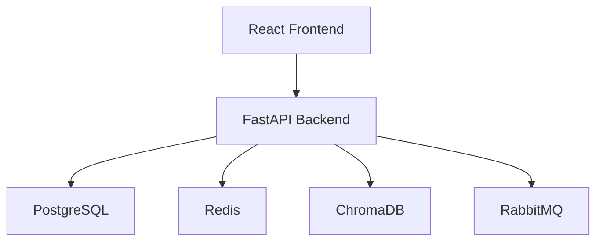
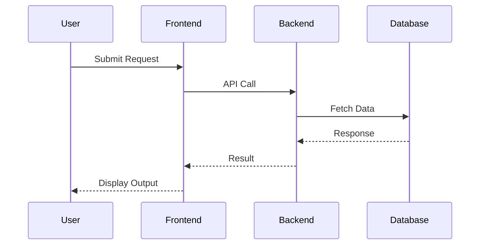

# 1. Executive Summary
The proposed system is a digital platform that provides a comprehensive suite of financial services, rewards, and benefits to its users. The platform aims to create a seamless and personalized experience for users, driving engagement, loyalty, and revenue growth. The system will have the following key benefits:
* A user-friendly and secure interface for managing financial services, rewards, and benefits
* A comprehensive suite of features, including credit card management, rewards tracking, travel booking, and exclusive benefits
* Personalized experiences and targeted offers to drive user engagement and loyalty
* A scalable and secure architecture to support a large user base

# 2. System Overview
The system will have the following components:
* Product Vision: To create a digital platform that provides a comprehensive suite of financial services, rewards, and benefits to its users
* User Journey: Users will be able to register for an account, log in securely, and access their financial information and rewards
* Core Functionalities:
	+ User registration and profile management
	+ Credit card management (application, activation, payment)
	+ Rewards tracking and redemption
	+ Travel booking and management
	+ Exclusive benefits and partnerships
* High-Level Workflow:
	1. User registration and login
	2. Credit card application and management
	3. Rewards tracking and redemption
	4. Travel booking and management
	5. Exclusive benefits and partnerships

# 3. High-Level Architecture
## Architecture Explanation
The system will have a microservices-based architecture, with each component communicating with others through APIs. The system will use a combination of relational and NoSQL databases to store user data, transaction history, and rewards information.
## System Architecture Diagram

# 4. Data Flow Diagram

# 5. Recommended Technology Stack
| Layer | Technology | Reason |
| --- | --- | --- |
| Frontend | React | Scalable, maintainable, and widely adopted |
| Backend | FastAPI | Fast, scalable, and secure |
| Database | PostgreSQL | Relational database with strong consistency and scalability |
| Cache | Redis | In-memory caching for improved performance |
| Vector Database | ChromaDB | Scalable and efficient vector database for rewards and benefits |
| Messaging | RabbitMQ | Reliable and scalable message queue for asynchronous processing |
| Authentication | OAuth | Secure and widely adopted authentication protocol |
| Monitoring | Prometheus | Scalable and widely adopted monitoring system |
| Deployment | Docker | Containerization for easy deployment and management |
| Cloud | AWS | Scalable and secure cloud platform with a wide range of services |

# 6. Core Components
* User Service: responsible for user registration, profile management, and authentication
* Credit Card Service: responsible for credit card application, activation, and payment
* Rewards Service: responsible for rewards tracking and redemption
* Travel Service: responsible for travel booking and management
* Exclusive Benefits Service: responsible for exclusive benefits and partnerships

# 7. Database Design
## Database Type
The system will use a combination of relational and NoSQL databases.
## Entities
* Users
* Credit Cards
* Rewards
* Travel Bookings
* Exclusive Benefits
## Relationships
* A user can have multiple credit cards
* A credit card can have multiple rewards
* A user can have multiple travel bookings
* A travel booking can have multiple exclusive benefits
## Database Schema
### Users Table
| Column | Type | Constraints |
| --- | --- | --- |
| id | UUID | PK |
| email | VARCHAR | UNIQUE |
| created_at | TIMESTAMP | NOT NULL |
### Credit Cards Table
| Column | Type | Constraints |
| --- | --- | --- |
| id | UUID | PK |
| user_id | UUID | FK |
| card_number | VARCHAR | NOT NULL |
| expiration_date | DATE | NOT NULL |
### Rewards Table
| Column | Type | Constraints |
| --- | --- | --- |
| id | UUID | PK |
| credit_card_id | UUID | FK |
| reward_type | VARCHAR | NOT NULL |
| reward_value | INTEGER | NOT NULL |
## ERD Explanation
The system will have a complex entity-relationship diagram, with multiple relationships between entities.

# 8. API Design
## User Service
### POST /api/v1/users
* Purpose: Create a new user
* Request Payload: { email, password }
* Response Payload: { id, email }
### GET /api/v1/users/{id}
* Purpose: Get a user by ID
* Request Payload: None
* Response Payload: { id, email }
## Credit Card Service
### POST /api/v1/credit-cards
* Purpose: Create a new credit card
* Request Payload: { user_id, card_number, expiration_date }
* Response Payload: { id, user_id, card_number }
### GET /api/v1/credit-cards/{id}
* Purpose: Get a credit card by ID
* Request Payload: None
* Response Payload: { id, user_id, card_number }

# 9. Authentication & Authorization
## Authentication Strategy
The system will use OAuth for authentication.
## JWT Usage
The system will use JSON Web Tokens (JWT) for authentication and authorization.
## Session Handling
The system will use a stateless session handling approach, with JWT stored in local storage.
## OAuth Support
The system will support OAuth 2.0 for authentication and authorization.
## Role-Based Access Control (RBAC)
The system will use RBAC for authorization, with roles defined for users and credit cards.

# 10. Security Considerations
## Input Validation
The system will use input validation to prevent SQL injection and cross-site scripting (XSS) attacks.
## API Security
The system will use API keys and JWT for authentication and authorization.
## JWT Security
The system will use secure JWT storage and transmission.
## Password Hashing
The system will use password hashing for secure password storage.
## Secrets Management
The system will use secrets management for secure storage and transmission of sensitive data.
## Encryption at Rest
The system will use encryption at rest for secure data storage.
## Encryption in Transit
The system will use encryption in transit for secure data transmission.
## Rate Limiting
The system will use rate limiting to prevent brute-force attacks.
## CORS
The system will use CORS to prevent cross-origin resource sharing attacks.
## OWASP Top 10 Mitigation
The system will mitigate the OWASP Top 10 security risks, including injection, broken authentication, and sensitive data exposure.

# 11. Scalability Considerations
## Horizontal Scaling
The system will use horizontal scaling to increase capacity and improve performance.
## Vertical Scaling
The system will use vertical scaling to increase capacity and improve performance.
## Load Balancing
The system will use load balancing to distribute traffic and improve performance.
## Auto Scaling
The system will use auto scaling to automatically adjust capacity and improve performance.
## Database Scaling
The system will use database scaling to increase capacity and improve performance.
## Read Replicas
The system will use read replicas to improve performance and reduce latency.
## Sharding
The system will use sharding to improve performance and reduce latency.
## Caching Strategy
The system will use caching to improve performance and reduce latency.
## Queue-Based Processing
The system will use queue-based processing to improve performance and reduce latency.

# 12. Monitoring & Logging
## Application Monitoring
The system will use application monitoring to track performance and identify issues.
## Infrastructure Monitoring
The system will use infrastructure monitoring to track performance and identify issues.
## Distributed Tracing
The system will use distributed tracing to track requests and identify issues.
## Log Aggregation
The system will use log aggregation to collect and analyze logs.
## Error Tracking
The system will use error tracking to track and resolve errors.
## Alerting
The system will use alerting to notify teams of issues and errors.

# 13. Deployment Architecture
## Development Environment
The system will use a development environment for testing and debugging.
## Staging Environment
The system will use a staging environment for testing and quality assurance.
## Production Environment
The system will use a production environment for deployment and operation.
## Docker
The system will use Docker for containerization and deployment.
## GitHub Actions
The system will use GitHub Actions for continuous integration and deployment.
## AWS Deployment Strategy
The system will use AWS for deployment and operation.

# 14. Cost Optimization Strategy
## Efficient Resource Usage
The system will use efficient resource usage to reduce costs.
## Auto Scaling
The system will use auto scaling to reduce costs and improve performance.
## Storage Optimization
The system will use storage optimization to reduce costs and improve performance.
## Compute Optimization
The system will use compute optimization to reduce costs and improve performance.
## Monitoring Costs
The system will use monitoring costs to track and optimize costs.

# 15. Risks & Challenges
## Technical Risks
The system will face technical risks, including scalability and performance issues.
## Security Risks
The system will face security risks, including data breaches and cyber attacks.
## Scalability Risks
The system will face scalability risks, including increased traffic and usage.
## Operational Risks
The system will face operational risks, including downtime and outages.

# 16. Disaster Recovery & Backup Strategy
## Database Backup Strategy
The system will use a database backup strategy to ensure data recovery.
## Recovery Procedures
The system will use recovery procedures to ensure business continuity.
## Failover Mechanisms
The system will use failover mechanisms to ensure high availability.
## High Availability Design
The system will use a high availability design to ensure uptime and performance.

# 17. Future Architecture Enhancements
## Microservices Migration
The system will migrate to microservices to improve scalability and performance.
## Event-Driven Architecture
The system will use an event-driven architecture to improve scalability and performance.
## AI Integration
The system will integrate AI to improve user experience and personalize recommendations.
## Multi-Region Deployment
The system will deploy in multiple regions to improve performance and reduce latency.
## Global Scaling
The system will scale globally to improve performance and reduce latency.