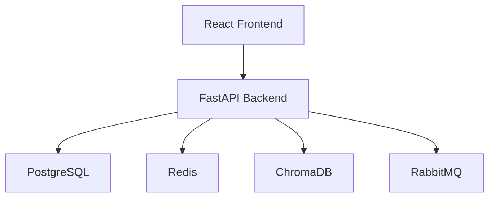
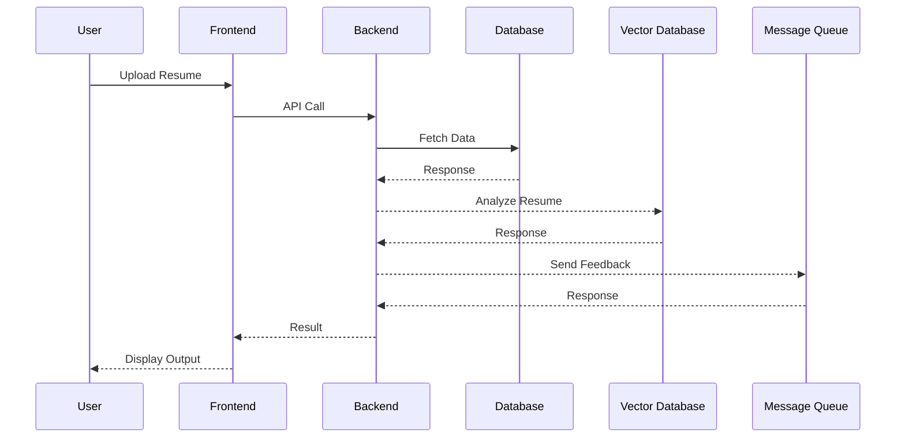

# 1. Executive Summary
The AI Resume Analyzer is a cutting-edge tool designed to revolutionize the recruitment process by leveraging artificial intelligence to analyze and evaluate resumes. This system aims to provide recruiters and hiring managers with a more efficient, accurate, and unbiased way to identify top talent, while also offering job seekers personalized feedback to improve their resume and increase their chances of landing their dream job.

## Purpose
The purpose of the AI Resume Analyzer is to streamline the hiring process, reduce time-to-hire, and enhance the overall candidate experience.

## Business Goals
The business goals of the AI Resume Analyzer are to reduce the time-to-hire by at least 30% and increase the quality of hires by at least 25%, while achieving a user satisfaction rating of at least 4.5 out of 5.

## Target Users
The primary target users of the AI Resume Analyzer are recruiters, hiring managers, and job seekers.

## Key Benefits
The key benefits of the AI Resume Analyzer include improved efficiency, accuracy, and fairness in the recruitment process, as well as personalized feedback and guidance for job seekers.

# 2. System Overview
## Product Vision
The product vision of the AI Resume Analyzer is to become the leading recruitment platform for small to medium-sized businesses and large enterprises.

## User Journey
The user journey of the AI Resume Analyzer involves the following steps:
1. User registration and login
2. Resume upload and parsing
3. Natural language processing and machine learning-based analysis
4. Candidate ranking and scoring
5. Personalized feedback and suggestions for job seekers

## Core Functionalities
The core functionalities of the AI Resume Analyzer include:
* Resume upload and parsing
* Natural language processing and machine learning-based analysis
* Candidate ranking and scoring
* Personalized feedback and suggestions for job seekers

## High-Level Workflow
The high-level workflow of the AI Resume Analyzer involves the following steps:
1. User uploads a resume
2. The system parses and analyzes the resume using natural language processing and machine learning algorithms
3. The system provides a ranked list of top candidates and personalized feedback and suggestions for job seekers

# 3. High-Level Architecture
## Architecture Explanation
The AI Resume Analyzer will utilize a microservices architecture, with separate services for user registration, resume upload and parsing, natural language processing and machine learning-based analysis, candidate ranking and scoring, and personalized feedback and suggestions.

## System Architecture Diagram

# 4. Data Flow Diagram

# 5. Recommended Technology Stack
| Layer | Technology | Reason |
|---------|------------|---------|
| Frontend | React | Scalable, maintainable, and efficient |
| Backend | FastAPI | Fast, scalable, and secure |
| Database | PostgreSQL | Relational database with strong consistency and durability |
| Cache | Redis | In-memory data store for fast data access |
| Vector Database | ChromaDB | Scalable and efficient vector database for machine learning |
| Messaging | RabbitMQ | Reliable and scalable message queue for job processing |
| Authentication | OAuth | Secure and standardized authentication protocol |
| Monitoring | Prometheus | Comprehensive monitoring and alerting system |
| Deployment | Docker | Containerization for easy deployment and management |
| Cloud | AWS | Scalable and secure cloud platform for deployment |

# 6. Core Components
* **User Service**: Handles user registration, login, and profile management
* **Resume Service**: Handles resume upload, parsing, and analysis
* **Analysis Service**: Handles natural language processing and machine learning-based analysis
* **Ranking Service**: Handles candidate ranking and scoring
* **Feedback Service**: Handles personalized feedback and suggestions for job seekers
* **Notification Service**: Handles notifications and alerts for users

# 7. Database Design
## Database Type
The AI Resume Analyzer will utilize a relational database (PostgreSQL) for storing user data and a vector database (ChromaDB) for storing resume data.

## Entities
The following entities will be stored in the database:
* Users
* Resumes
* Jobs
* Candidates

## Relationships
The following relationships will exist between entities:
* A user can have multiple resumes
* A resume can be associated with multiple jobs
* A job can have multiple candidates

## Database Schema
### Users Table
| Column | Type | Constraints |
|----------|----------|------------|
| id | UUID | PK |
| email | VARCHAR | UNIQUE |
| created_at | TIMESTAMP | NOT NULL |

### Resumes Table
| Column | Type | Constraints |
|----------|----------|------------|
| id | UUID | PK |
| user_id | UUID | FK |
| file | BYTEA | NOT NULL |
| created_at | TIMESTAMP | NOT NULL |

### Jobs Table
| Column | Type | Constraints |
|----------|----------|------------|
| id | UUID | PK |
| title | VARCHAR | NOT NULL |
| description | TEXT | NOT NULL |
| created_at | TIMESTAMP | NOT NULL |

### Candidates Table
| Column | Type | Constraints |
|----------|----------|------------|
| id | UUID | PK |
| job_id | UUID | FK |
| resume_id | UUID | FK |
| score | FLOAT | NOT NULL |
| created_at | TIMESTAMP | NOT NULL |

## ERD Explanation
The entity-relationship diagram (ERD) explains the relationships between entities in the database. A user can have multiple resumes, and a resume can be associated with multiple jobs. A job can have multiple candidates, and a candidate is associated with a job and a resume.

# 8. API Design
## API Endpoints
The following API endpoints will be available:
* **POST /api/v1/users**: Create a new user
* **GET /api/v1/users**: Get all users
* **GET /api/v1/users/{id}**: Get a user by ID
* **POST /api/v1/resumes**: Upload a new resume
* **GET /api/v1/resumes**: Get all resumes
* **GET /api/v1/resumes/{id}**: Get a resume by ID
* **POST /api/v1/jobs**: Create a new job
* **GET /api/v1/jobs**: Get all jobs
* **GET /api/v1/jobs/{id}**: Get a job by ID
* **POST /api/v1/candidates**: Create a new candidate
* **GET /api/v1/candidates**: Get all candidates
* **GET /api/v1/candidates/{id}**: Get a candidate by ID

## API Request/Response Payload
The API request and response payload will be in JSON format.

# 9. Authentication & Authorization
## Authentication Strategy
The AI Resume Analyzer will utilize OAuth for authentication.

## JWT Usage
JSON Web Tokens (JWT) will be used for authentication and authorization.

## Session Handling
Sessions will be handled using JWT.

## OAuth Support
The AI Resume Analyzer will support OAuth for authentication and authorization.

## Role-Based Access Control (RBAC)
The AI Resume Analyzer will utilize RBAC for access control.

# 10. Security Considerations
## Input Validation
Input validation will be performed on all user input.

## API Security
API security will be ensured using OAuth and JWT.

## JWT Security
JWT security will be ensured using secure key management and token expiration.

## Password Hashing
Password hashing will be performed using a secure hashing algorithm.

## Secrets Management
Secrets management will be performed using a secure secrets management system.

## Encryption at Rest
Encryption at rest will be performed using a secure encryption algorithm.

## Encryption in Transit
Encryption in transit will be performed using a secure encryption algorithm.

## Rate Limiting
Rate limiting will be performed to prevent abuse.

## CORS
CORS will be configured to allow cross-origin requests.

## OWASP Top 10 Mitigation
The AI Resume Analyzer will mitigate the OWASP Top 10 security risks.

# 11. Scalability Considerations
## Horizontal Scaling
The AI Resume Analyzer will be designed to scale horizontally.

## Vertical Scaling
The AI Resume Analyzer will be designed to scale vertically.

## Load Balancing
Load balancing will be performed to distribute traffic.

## Auto Scaling
Auto scaling will be performed to scale resources based on demand.

## Database Scaling
Database scaling will be performed to scale the database based on demand.

## Read Replicas
Read replicas will be used to improve read performance.

## Sharding
Sharding will be used to improve write performance.

## Caching Strategy
A caching strategy will be implemented to improve performance.

## Queue-Based Processing
Queue-based processing will be used to improve performance.

# 12. Monitoring & Logging
## Application Monitoring
Application monitoring will be performed using Prometheus.

## Infrastructure Monitoring
Infrastructure monitoring will be performed using Prometheus.

## Distributed Tracing
Distributed tracing will be performed using OpenTelemetry.

## Log Aggregation
Log aggregation will be performed using ELK Stack.

## Error Tracking
Error tracking will be performed using Sentry.

## Alerting
Alerting will be performed using PagerDuty.

# 13. Deployment Architecture
## Development Environment
The development environment will be set up using Docker and GitHub Actions.

## Staging Environment
The staging environment will be set up using Docker and GitHub Actions.

## Production Environment
The production environment will be set up using Docker and GitHub Actions.

## Deployment Workflow
The deployment workflow will be automated using GitHub Actions.

# 14. Cost Optimization Strategy
## Efficient Resource Usage
Efficient resource usage will be ensured by monitoring and optimizing resource utilization.

## Auto Scaling
Auto scaling will be performed to scale resources based on demand.

## Storage Optimization
Storage optimization will be performed by using efficient storage solutions.

## Compute Optimization
Compute optimization will be performed by using efficient compute resources.

## Monitoring Costs
Monitoring costs will be performed to ensure cost-effectiveness.

# 15. Risks & Challenges
## Technical Risks
Technical risks include data quality issues, algorithmic bias, and integration challenges.

## Security Risks
Security risks include data breaches, unauthorized access, and denial-of-service attacks.

## Scalability Risks
Scalability risks include inability to scale, performance issues, and resource constraints.

## Operational Risks
Operational risks include downtime, data loss, and reputational damage.

## Mitigation Strategies
Mitigation strategies include data quality checks, algorithmic bias detection, security measures, scalability planning, and operational monitoring.

# 16. Disaster Recovery & Backup Strategy
## Database Backup Strategy
The database will be backed up regularly using a backup tool.

## Recovery Procedures
Recovery procedures will be established to ensure quick recovery in case of a disaster.

## Failover Mechanisms
Failover mechanisms will be established to ensure high availability.

## High Availability Design
The system will be designed to ensure high availability using load balancing, auto scaling, and failover mechanisms.

# 17. Future Architecture Enhancements
## Microservices Migration
The system will be migrated to a microservices architecture to improve scalability and maintainability.

## Event-Driven Architecture
The system will be migrated to an event-driven architecture to improve performance and scalability.

## AI Integration
The system will be integrated with AI and machine learning algorithms to improve accuracy and efficiency.

## Multi-Region Deployment
The system will be deployed in multiple regions to improve availability and reduce latency.

## Global Scaling
The system will be designed to scale globally to meet increasing demand.