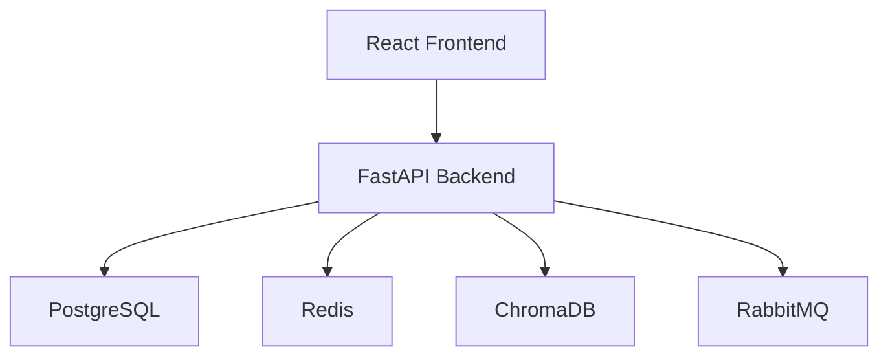
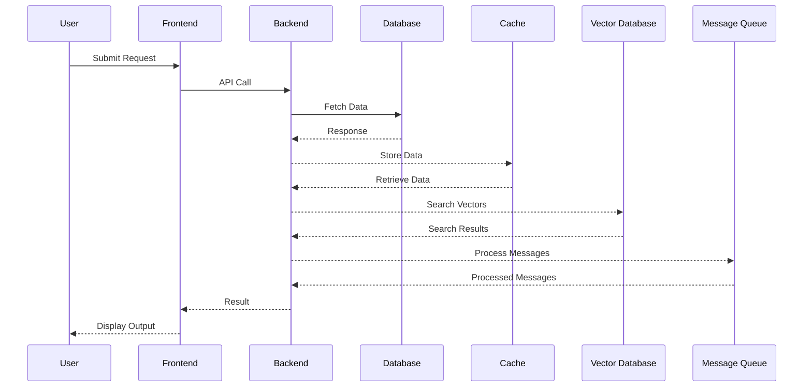

# 1. Executive Summary
The proposed system is a dating app called "LoveConnect" that aims to revolutionize the online dating experience by providing a secure, user-friendly, and personalized platform for individuals to connect with like-minded people. The app will prioritize user safety, security, and satisfaction, and will utilize machine learning algorithms and social networking principles to facilitate meaningful connections. The key benefits of the system include a unique and engaging user experience, a sophisticated matching algorithm, and a strong focus on user safety and security.

# 2. System Overview
The system will have the following core functionalities:
* User registration and profile creation
* Profile verification and authentication
* Matching algorithm based on user preferences and interests
* In-app messaging and chat functionality
* User search and filtering
* Event planning and group activities
* Integration with social media platforms for optional sharing

The user journey will involve the following steps:
1. User registration and profile creation
2. Profile verification and authentication
3. Completion of a comprehensive user profile, including preferences and interests
4. Receipt of relevant matches based on the matching algorithm
5. Engagement in meaningful conversations with matches
6. Participation in events and group activities

# 3. High-Level Architecture
## Architecture Explanation
The system will consist of the following components:
* Frontend: React + Tailwind CSS for a responsive and user-friendly interface
* Backend: FastAPI for a fast and scalable API
* Database: PostgreSQL for a robust and reliable data storage
* Cache: Redis for improved performance and reduced latency
* Vector Database: ChromaDB for efficient and scalable vector search
* Message Queue: RabbitMQ for reliable and efficient message processing

## System Architecture Diagram

# 4. Data Flow Diagram

# 5. Recommended Technology Stack
| Layer | Technology | Reason |
| --- | --- | --- |
| Frontend | React + Tailwind CSS | Fast and scalable, with a large community and extensive libraries |
| Backend | FastAPI | Fast and scalable, with strong support for asynchronous programming and automatic API documentation |
| Database | PostgreSQL | Robust and reliable, with strong support for SQL and NoSQL data models |
| Cache | Redis | Fast and scalable, with strong support for key-value and pub-sub data models |
| Vector Database | ChromaDB | Efficient and scalable, with strong support for vector search and similarity metrics |
| Message Queue | RabbitMQ | Reliable and efficient, with strong support for message processing and queue management |
| Authentication | OAuth 2.0 | Secure and standardized, with strong support for authentication and authorization |
| Monitoring | Prometheus + Grafana | Comprehensive and scalable, with strong support for metrics and logging |
| Deployment | Docker + GitHub Actions | Fast and scalable, with strong support for containerization and continuous integration |
| Cloud | AWS | Comprehensive and scalable, with strong support for infrastructure and services |

# 6. Core Components
* **User Service**: responsible for user registration, profile creation, and authentication
* **Matching Service**: responsible for matching users based on preferences and interests
* **Messaging Service**: responsible for in-app messaging and chat functionality
* **Search Service**: responsible for user search and filtering
* **Event Service**: responsible for event planning and group activities
* **Authentication Service**: responsible for authentication and authorization

# 7. Database Design
## Database Type
The system will use a relational database (PostgreSQL) for storing user data and a NoSQL database (Redis) for storing cache data.

## Entities
The system will have the following entities:
* **Users**: stores user information, including profiles and preferences
* **Matches**: stores match information, including user pairs and match scores
* **Messages**: stores message information, including user conversations and message history
* **Events**: stores event information, including event details and attendee lists

## Relationships
The system will have the following relationships:
* **Users**: a user can have multiple matches, and a match can have multiple users
* **Matches**: a match can have multiple messages, and a message can have multiple matches
* **Events**: an event can have multiple attendees, and an attendee can have multiple events

## Database Schema
### Users Table
| Column | Type | Constraints |
| --- | --- | --- |
| id | UUID | PK |
| email | VARCHAR | UNIQUE |
| password | VARCHAR | NOT NULL |
| created_at | TIMESTAMP | NOT NULL |

### Matches Table
| Column | Type | Constraints |
| --- | --- | --- |
| id | UUID | PK |
| user_id | UUID | FK |
| match_id | UUID | FK |
| match_score | FLOAT | NOT NULL |
| created_at | TIMESTAMP | NOT NULL |

### Messages Table
| Column | Type | Constraints |
| --- | --- | --- |
| id | UUID | PK |
| user_id | UUID | FK |
| match_id | UUID | FK |
| message_text | TEXT | NOT NULL |
| created_at | TIMESTAMP | NOT NULL |

## ERD Explanation
The system will use a relational database to store user data, with a separate table for each entity. The relationships between entities will be established using foreign keys.

# 8. API Design
The system will have the following APIs:
* **User API**: responsible for user registration, profile creation, and authentication
* **Match API**: responsible for matching users based on preferences and interests
* **Message API**: responsible for in-app messaging and chat functionality
* **Search API**: responsible for user search and filtering
* **Event API**: responsible for event planning and group activities

## User API
### POST /api/v1/users
* Purpose: create a new user
* Request Payload: user information, including email and password
* Response Payload: user ID and authentication token

### GET /api/v1/users/{id}
* Purpose: retrieve a user's profile information
* Request Payload: user ID
* Response Payload: user profile information

## Match API
### POST /api/v1/matches
* Purpose: create a new match
* Request Payload: user ID and match preferences
* Response Payload: match ID and match score

### GET /api/v1/matches/{id}
* Purpose: retrieve a match's information
* Request Payload: match ID
* Response Payload: match information, including user pairs and match score

# 9. Authentication & Authorization
The system will use OAuth 2.0 for authentication and authorization. The system will have the following roles:
* **User**: can create and manage their own profile, and participate in events and group activities
* **Admin**: can manage user accounts, and configure system settings

# 10. Security Considerations
The system will have the following security considerations:
* **Input Validation**: validate all user input to prevent SQL injection and cross-site scripting (XSS) attacks
* **API Security**: use secure APIs, including HTTPS and OAuth 2.0, to protect user data
* **JWT Security**: use secure JSON Web Tokens (JWT) to authenticate and authorize users
* **Password Hashing**: use secure password hashing, including bcrypt and scrypt, to protect user passwords
* **Secrets Management**: use secure secrets management, including environment variables and secure storage, to protect sensitive data

# 11. Scalability Considerations
The system will have the following scalability considerations:
* **Horizontal Scaling**: use load balancers and auto-scaling groups to scale the system horizontally
* **Vertical Scaling**: use instance types and resource allocation to scale the system vertically
* **Load Balancing**: use load balancers to distribute traffic and improve system performance
* **Auto Scaling**: use auto-scaling groups to scale the system automatically based on demand
* **Database Scaling**: use database scaling, including sharding and replication, to improve database performance

# 12. Monitoring & Logging
The system will have the following monitoring and logging considerations:
* **Application Monitoring**: use application monitoring, including Prometheus and Grafana, to monitor system performance
* **Infrastructure Monitoring**: use infrastructure monitoring, including AWS CloudWatch, to monitor system resources
* **Distributed Tracing**: use distributed tracing, including OpenTelemetry, to monitor system requests
* **Log Aggregation**: use log aggregation, including ELK Stack, to monitor system logs
* **Error Tracking**: use error tracking, including Sentry, to monitor system errors

# 13. Deployment Architecture
The system will have the following deployment architecture:
* **Development Environment**: use a development environment, including Docker and GitHub Actions, to develop and test the system
* **Staging Environment**: use a staging environment, including Docker and GitHub Actions, to test and validate the system
* **Production Environment**: use a production environment, including Docker and GitHub Actions, to deploy and manage the system

## Deployment Workflow
The system will have the following deployment workflow:
1. Develop and test the system in the development environment
2. Deploy the system to the staging environment for testing and validation
3. Deploy the system to the production environment for deployment and management

# 14. Cost Optimization Strategy
The system will have the following cost optimization strategy:
* **Efficient Resource Usage**: use efficient resource usage, including auto-scaling and load balancing, to reduce costs
* **Auto Scaling**: use auto-scaling groups to scale the system automatically based on demand
* **Storage Optimization**: use storage optimization, including data compression and caching, to reduce storage costs
* **Compute Optimization**: use compute optimization, including instance types and resource allocation, to reduce compute costs
* **Monitoring Costs**: use monitoring costs, including AWS CloudWatch, to monitor and optimize system costs

# 15. Risks & Challenges
The system will have the following risks and challenges:
* **Technical Risks**: use technical risks, including security and scalability, to identify and mitigate technical risks
* **Security Risks**: use security risks, including input validation and API security, to identify and mitigate security risks
* **Scalability Risks**: use scalability risks, including horizontal and vertical scaling, to identify and mitigate scalability risks
* **Operational Risks**: use operational risks, including deployment and management, to identify and mitigate operational risks

# 16. Disaster Recovery & Backup Strategy
The system will have the following disaster recovery and backup strategy:
* **Database Backup**: use database backup, including PostgreSQL and Redis, to backup system data
* **Recovery Procedures**: use recovery procedures, including data restoration and system restart, to recover system data
* **Failover Mechanisms**: use failover mechanisms, including load balancers and auto-scaling groups, to failover system components
* **High Availability Design**: use high availability design, including redundancy and failover, to design a highly available system

# 17. Future Architecture Enhancements
The system will have the following future architecture enhancements:
* **Microservices Migration**: migrate the system to a microservices architecture to improve scalability and maintainability
* **Event-Driven Architecture**: migrate the system to an event-driven architecture to improve scalability and responsiveness
* **AI Integration**: integrate AI and machine learning into the system to improve user experience and system performance
* **Multi-Region Deployment**: deploy the system in multiple regions to improve availability and reduce latency
* **Global Scaling**: scale the system globally to improve availability and reduce latency