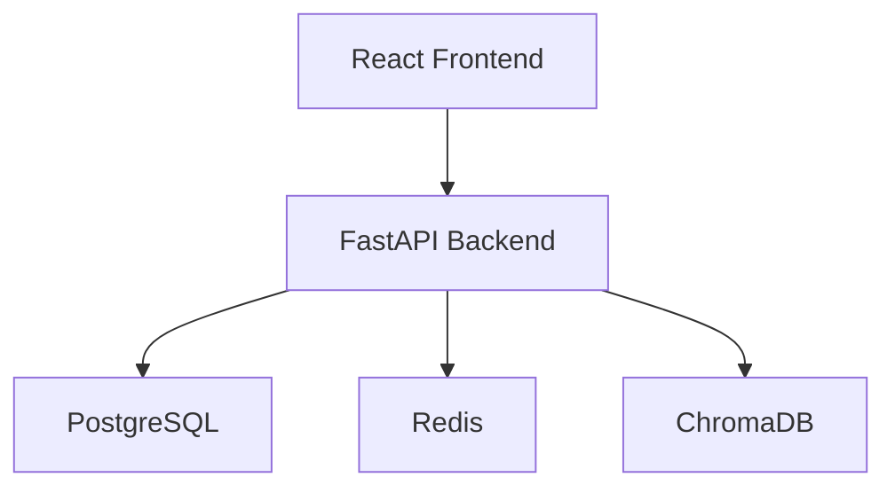
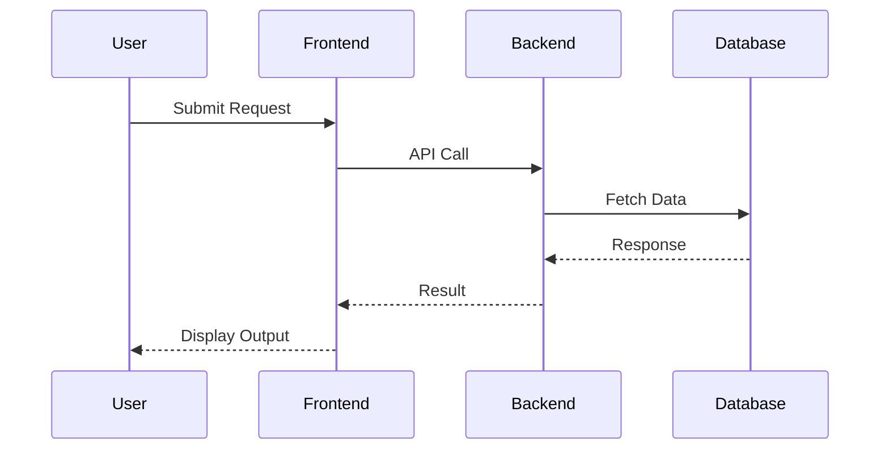

# 1. Executive Summary
The proposed system is a dating app called "LoveConnect" that aims to revolutionize the online dating experience by providing a secure, user-friendly, and personalized platform for individuals to connect with like-minded people. The app will utilize machine learning algorithms and natural language processing to offer a unique matching system, ensuring meaningful relationships and a high level of user satisfaction. The system will be designed with scalability, security, and user experience in mind, and will generate revenue through subscription-based models and targeted advertising.

# 2. System Overview
## Product Vision
The product vision is to create a leading dating app that provides a safe, secure, and enjoyable experience for users, while also generating significant revenue through subscription-based models and targeted advertising.

## User Journey
The user journey will begin with user registration and profile creation, followed by the matching algorithm suggesting potential matches. Users will then be able to engage in secure and private conversations with their matches, and eventually meet in person.

## Core Functionalities
The core functionalities of the system will include:
* User registration and profile creation
* Matching algorithm that considers user preferences, interests, and values
* In-app messaging and chat functionality
* Photo and video sharing
* User verification and moderation processes
* Subscription-based models for premium features

## High-Level Workflow
The high-level workflow of the system will be as follows:
1. User registration and profile creation
2. Matching algorithm suggests potential matches
3. Users engage in secure and private conversations with their matches
4. Users meet in person
5. Users provide feedback on their experience

# 3. High-Level Architecture
## Architecture Explanation
The system will consist of a React frontend, a FastAPI backend, a PostgreSQL database, a Redis cache, and a ChromaDB vector database. The frontend will handle user interactions, while the backend will handle business logic and database interactions. The database will store user data, match data, and conversation data. The cache will store frequently accessed data to improve performance. The vector database will store user embeddings for the matching algorithm.

## System Architecture Diagram

# 4. Data Flow Diagram

# 5. Recommended Technology Stack
| Layer | Technology | Reason |
| --- | --- | --- |
| Frontend | React | Popular and widely-used framework for building user interfaces |
| Backend | FastAPI | Fast and scalable framework for building APIs |
| Database | PostgreSQL | Robust and feature-rich relational database |
| Cache | Redis | High-performance and scalable cache |
| Vector Database | ChromaDB | Specialized database for storing and querying vector embeddings |
| Messaging | RabbitMQ | Reliable and scalable message broker |
| Authentication | OAuth | Standardized and widely-used authentication protocol |
| Monitoring | Prometheus | Popular and widely-used monitoring system |
| Deployment | Docker | Lightweight and portable containerization platform |
| Cloud | AWS | Scalable and reliable cloud platform |

# 6. Core Components
* **User Service**: Handles user registration, profile creation, and user data management
* **Matching Service**: Handles the matching algorithm and suggests potential matches
* **Conversation Service**: Handles in-app messaging and chat functionality
* **Verification Service**: Handles user verification and moderation processes
* **Payment Service**: Handles subscription-based models and payment processing

# 7. Database Design
## Database Type
The database will be a relational database, using PostgreSQL as the database management system.

## Entities
The entities in the database will include:
* **Users**: Stores user data, such as name, age, location, and interests
* **Matches**: Stores match data, such as user IDs and match scores
* **Conversations**: Stores conversation data, such as messages and timestamps
* **Payments**: Stores payment data, such as subscription plans and payment history

## Relationships
The relationships between entities will be as follows:
* A user can have many matches (one-to-many)
* A match is between two users (many-to-many)
* A conversation is between two users (many-to-many)
* A payment is associated with one user (one-to-one)

## Database Schema
### Users Table
| Column | Type | Constraints |
| --- | --- | --- |
| id | UUID | PRIMARY KEY |
| name | VARCHAR | NOT NULL |
| age | INTEGER | NOT NULL |
| location | VARCHAR | NOT NULL |
| interests | VARCHAR | NOT NULL |

### Matches Table
| Column | Type | Constraints |
| --- | --- | --- |
| id | UUID | PRIMARY KEY |
| user_id | UUID | FOREIGN KEY REFERENCES Users(id) |
| match_id | UUID | FOREIGN KEY REFERENCES Users(id) |
| score | FLOAT | NOT NULL |

### Conversations Table
| Column | Type | Constraints |
| --- | --- | --- |
| id | UUID | PRIMARY KEY |
| user_id | UUID | FOREIGN KEY REFERENCES Users(id) |
| match_id | UUID | FOREIGN KEY REFERENCES Matches(id) |
| message | VARCHAR | NOT NULL |
| timestamp | TIMESTAMP | NOT NULL |

## ERD Explanation
The ERD shows the relationships between entities in the database. A user can have many matches, and a match is between two users. A conversation is between two users, and a payment is associated with one user.

# 8. API Design
## User API
### GET /api/v1/users
* Purpose: Retrieve a list of users
* Request Payload: None
* Response Payload: List of user objects

### POST /api/v1/users
* Purpose: Create a new user
* Request Payload: User object
* Response Payload: Created user object

## Match API
### GET /api/v1/matches
* Purpose: Retrieve a list of matches for a user
* Request Payload: User ID
* Response Payload: List of match objects

### POST /api/v1/matches
* Purpose: Create a new match
* Request Payload: Match object
* Response Payload: Created match object

## Conversation API
### GET /api/v1/conversations
* Purpose: Retrieve a list of conversations for a user
* Request Payload: User ID
* Response Payload: List of conversation objects

### POST /api/v1/conversations
* Purpose: Create a new conversation
* Request Payload: Conversation object
* Response Payload: Created conversation object

# 9. Authentication & Authorization
## Authentication Strategy
The system will use OAuth as the authentication strategy.

## JWT Usage
The system will use JSON Web Tokens (JWT) to authenticate and authorize users.

## Session Handling
The system will use a session-based approach to handle user sessions.

## OAuth Support
The system will support OAuth 2.0 for authentication and authorization.

## Role-Based Access Control (RBAC)
The system will use RBAC to control access to resources based on user roles.

# 10. Security Considerations
## Input Validation
The system will validate all user input to prevent SQL injection and cross-site scripting (XSS) attacks.

## API Security
The system will use API keys and JWT to secure API endpoints.

## JWT Security
The system will use secure JWT secrets and expiration times to prevent token tampering.

## Password Hashing
The system will use bcrypt to hash and store user passwords securely.

## Secrets Management
The system will use a secrets management system to store and manage sensitive data.

## Encryption at Rest
The system will use encryption at rest to protect user data stored in the database.

## Encryption in Transit
The system will use encryption in transit to protect user data transmitted over the network.

## Rate Limiting
The system will use rate limiting to prevent brute-force attacks and denial-of-service (DoS) attacks.

## CORS
The system will use CORS to allow cross-origin requests and prevent XSS attacks.

## OWASP Top 10 Mitigation
The system will mitigate the OWASP Top 10 vulnerabilities, including injection, broken authentication, and sensitive data exposure.

# 11. Scalability Considerations
## Horizontal Scaling
The system will use horizontal scaling to increase capacity and handle increased traffic.

## Vertical Scaling
The system will use vertical scaling to increase resources and handle increased traffic.

## Load Balancing
The system will use load balancing to distribute traffic across multiple instances.

## Auto Scaling
The system will use auto scaling to automatically adjust capacity based on traffic.

## Database Scaling
The system will use database scaling to increase database capacity and handle increased traffic.

## Read Replicas
The system will use read replicas to offload read traffic and improve performance.

## Sharding
The system will use sharding to distribute data across multiple databases and improve performance.

## Caching Strategy
The system will use a caching strategy to improve performance and reduce latency.

## Queue-Based Processing
The system will use queue-based processing to handle asynchronous tasks and improve performance.

# 12. Monitoring & Logging
## Application Monitoring
The system will use application monitoring to monitor application performance and health.

## Infrastructure Monitoring
The system will use infrastructure monitoring to monitor infrastructure performance and health.

## Distributed Tracing
The system will use distributed tracing to monitor and debug distributed systems.

## Log Aggregation
The system will use log aggregation to collect and analyze logs from multiple sources.

## Error Tracking
The system will use error tracking to monitor and debug errors.

## Alerting
The system will use alerting to notify teams of issues and errors.

# 13. Deployment Architecture
## Development Environment
The development environment will use a local development setup with Docker and GitHub Actions.

## Staging Environment
The staging environment will use a staging setup with Docker and GitHub Actions.

## Production Environment
The production environment will use a production setup with Docker, GitHub Actions, and AWS.

# 14. Cost Optimization Strategy
## Efficient Resource Usage
The system will use efficient resource usage to minimize costs.

## Auto Scaling
The system will use auto scaling to automatically adjust capacity and minimize costs.

## Storage Optimization
The system will use storage optimization to minimize storage costs.

## Compute Optimization
The system will use compute optimization to minimize compute costs.

## Monitoring Costs
The system will use monitoring costs to monitor and optimize costs.

# 15. Risks & Challenges
## Technical Risks
The system will face technical risks, including scalability, security, and performance issues.

## Security Risks
The system will face security risks, including data breaches, SQL injection, and XSS attacks.

## Scalability Risks
The system will face scalability risks, including increased traffic and capacity issues.

## Operational Risks
The system will face operational risks, including downtime, errors, and maintenance issues.

# 16. Disaster Recovery & Backup Strategy
## Database Backup Strategy
The system will use a database backup strategy to backup and restore data.

## Recovery Procedures
The system will use recovery procedures to recover from disasters and outages.

## Failover Mechanisms
The system will use failover mechanisms to automatically failover to backup systems.

## High Availability Design
The system will use a high availability design to ensure system availability and uptime.

# 17. Future Architecture Enhancements
## Microservices Migration
The system will migrate to a microservices architecture to improve scalability and maintainability.

## Event-Driven Architecture
The system will use an event-driven architecture to improve performance and scalability.

## AI Integration
The system will integrate AI and machine learning to improve matching and recommendation algorithms.

## Multi-Region Deployment
The system will deploy to multiple regions to improve availability and reduce latency.

## Global Scaling
The system will scale globally to handle increased traffic and demand.