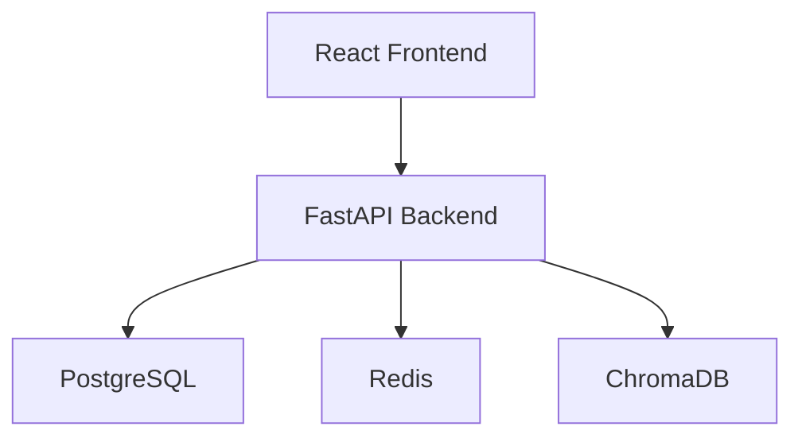
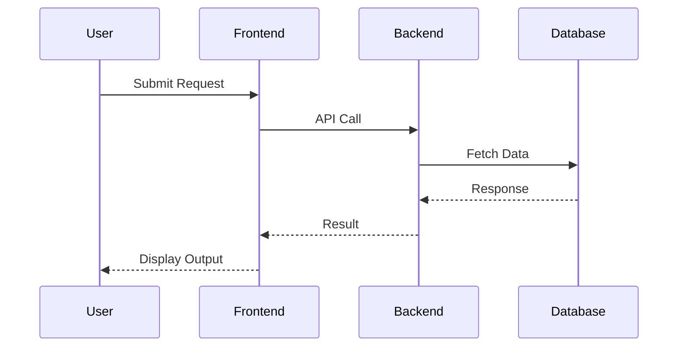

# 1. Executive Summary

## Purpose
LoveConnect is a modern dating app designed to help users find meaningful connections and relationships.

## Business Goals
Our mission is to create a safe, inclusive, and user-friendly platform that fosters genuine interactions and relationships.

## Target Users
Demographics: 18-45 years old, urban, and educated
Psychographics: Individuals seeking meaningful relationships, interested in technology, and value user experience

## Key Benefits
- AI-driven matchmaking
- User-centric design
- Robust safety features
- Intuitive and user-friendly experience
- Freemium model and in-app purchases

# 2. System Overview

## Product Vision
LoveConnect aims to revolutionize the dating app landscape by providing a unique value proposition for users.

## User Journey
1. User profile creation
2. Matchmaking algorithm
3. Chat and messaging
4. Safety features (reporting and blocking)

## Core Functionalities
- User profile creation
- Matchmaking algorithm
- Chat and messaging
- Safety features

## High-Level Workflow
1. User creates a profile
2. Algorithm matches users based on compatibility, interests, and preferences
3. Users engage in text-based conversations with matches
4. Users report suspicious behavior or block users

# 3. High-Level Architecture

## Architecture Explanation
The system consists of the following components:
- Frontend: React + Tailwind CSS
- Backend: FastAPI
- Database: PostgreSQL
- Cache: Redis
- Vector Database: ChromaDB
- Message Queue: RabbitMQ
- Containerization: Docker
- CI/CD: GitHub Actions
- Cloud Platform: AWS

## System Architecture Diagram

# 4. Data Flow Diagram

# 5. Recommended Technology Stack

| Layer | Technology | Reason |
|---------|------------|---------|
| Frontend | React + Tailwind CSS | Scalable, maintainable, and user-friendly |
| Backend | FastAPI | High-performance, scalable, and secure |
| Database | PostgreSQL | Robust, scalable, and reliable |
| Cache | Redis | Fast, scalable, and easy to use |
| Vector Database | ChromaDB | High-performance, scalable, and efficient |
| Message Queue | RabbitMQ | Scalable, reliable, and fault-tolerant |
| Containerization | Docker | Portable, scalable, and efficient |
| CI/CD | GitHub Actions | Scalable, reliable, and automated |
| Cloud Platform | AWS | Scalable, secure, and reliable |

# 6. Core Components

## User Service
- Name: User Service
- Purpose: Manage user profiles and interactions
- Responsibilities:
	+ User profile creation
	+ Matchmaking algorithm
	+ Chat and messaging

## Authentication Service
- Name: Authentication Service
- Purpose: Manage user authentication and authorization
- Responsibilities:
	+ User authentication
	+ Authorization and access control

## Payment Service
- Name: Payment Service
- Purpose: Manage in-app purchases and payments
- Responsibilities:
	+ In-app purchases
	+ Payment processing

## Notification Service
- Name: Notification Service
- Purpose: Manage user notifications and alerts
- Responsibilities:
	+ User notifications
	+ Alert management

## Analytics Service
- Name: Analytics Service
- Purpose: Manage user analytics and insights
- Responsibilities:
	+ User analytics
	+ Insights and reporting

## AI Processing Service
- Name: AI Processing Service
- Purpose: Manage AI-driven matchmaking and recommendations
- Responsibilities:
	+ Matchmaking algorithm
	+ Recommendations and suggestions

# 7. Database Design

## Database Type
Relational database (PostgreSQL)

## Entities
- Users
- Matches
- Conversations
- Messages
- Reports

## Relationships
- One-to-many: User to Matches
- One-to-many: User to Conversations
- One-to-many: Conversation to Messages
- One-to-many: User to Reports

## Database Schema

### Users Table

| Column | Type | Constraints |
|----------|----------|------------|
| id | UUID | PK |
| email | VARCHAR | UNIQUE |
| created_at | TIMESTAMP | NOT NULL |

### Matches Table

| Column | Type | Constraints |
|----------|----------|------------|
| match_id | UUID | PK |
| user_id | UUID | FK |
| match_date | TIMESTAMP | NOT NULL |

### Conversations Table

| Column | Type | Constraints |
|----------|----------|------------|
| conversation_id | UUID | PK |
| user_id | UUID | FK |
| conversation_date | TIMESTAMP | NOT NULL |

### Messages Table

| Column | Type | Constraints |
|----------|----------|------------|
| message_id | UUID | PK |
| conversation_id | UUID | FK |
| message_date | TIMESTAMP | NOT NULL |

### Reports Table

| Column | Type | Constraints |
|----------|----------|------------|
| report_id | UUID | PK |
| user_id | UUID | FK |
| report_date | TIMESTAMP | NOT NULL |

## ERD Explanation
The entities are connected through relationships, allowing for efficient data retrieval and manipulation.

# 8. API Design

## REST API Specifications

### User API

- POST /api/v1/users: Create a new user
- GET /api/v1/users/{id}: Retrieve a user by ID
- PUT /api/v1/users/{id}: Update a user
- DELETE /api/v1/users/{id}: Delete a user

### Match API

- GET /api/v1/matches: Retrieve all matches for a user
- POST /api/v1/matches: Create a new match
- PUT /api/v1/matches/{id}: Update a match
- DELETE /api/v1/matches/{id}: Delete a match

### Conversation API

- GET /api/v1/conversations: Retrieve all conversations for a user
- POST /api/v1/conversations: Create a new conversation
- PUT /api/v1/conversations/{id}: Update a conversation
- DELETE /api/v1/conversations/{id}: Delete a conversation

### Message API

- GET /api/v1/messages: Retrieve all messages for a conversation
- POST /api/v1/messages: Create a new message
- PUT /api/v1/messages/{id}: Update a message
- DELETE /api/v1/messages/{id}: Delete a message

### Report API

- GET /api/v1/reports: Retrieve all reports for a user
- POST /api/v1/reports: Create a new report
- PUT /api/v1/reports/{id}: Update a report
- DELETE /api/v1/reports/{id}: Delete a report

# 9. Authentication & Authorization

## Authentication Strategy
- JWT (JSON Web Token) for authentication
- OAuth 2.0 for authorization

## JWT Usage
- Generate a JWT token upon successful user authentication
- Validate the JWT token on each API request

## Session Handling
- Use a session store to manage user sessions
- Store the JWT token in the session store

## OAuth Support
- Implement OAuth 2.0 for authorization
- Use OAuth 2.0 to authenticate users

## Role-Based Access Control (RBAC)
- Define user roles and permissions
- Use RBAC to control access to resources

## User Roles and Permissions
- Admin: Full access to all resources
- Moderator: Access to moderation tools
- User: Access to user resources

# 10. Security Considerations

## Input Validation
- Validate user input to prevent SQL injection and cross-site scripting (XSS) attacks

## API Security
- Use HTTPS to encrypt API requests and responses
- Implement rate limiting to prevent brute-force attacks

## JWT Security
- Use a secure secret key to sign JWT tokens
- Implement token blacklisting to prevent token reuse

## Password Hashing
- Use a secure password hashing algorithm (e.g., bcrypt)
- Store hashed passwords in the database

## Secrets Management
- Use a secrets manager to store sensitive data (e.g., API keys)
- Rotate secrets regularly to prevent compromise

## Encryption at Rest
- Use encryption to protect data at rest
- Use a secure encryption algorithm (e.g., AES)

## Encryption in Transit
- Use HTTPS to encrypt data in transit
- Use a secure encryption algorithm (e.g., TLS)

## Rate Limiting
- Implement rate limiting to prevent brute-force attacks
- Use a rate limiting algorithm (e.g., token bucket)

## CORS
- Implement CORS to allow cross-origin requests
- Use a secure CORS policy (e.g., allow-origin)

## OWASP Top 10 Mitigation
- Implement mitigation strategies for OWASP Top 10 vulnerabilities
- Use a secure coding practice (e.g., secure coding guidelines)

# 11. Scalability Considerations

## Horizontal Scaling
- Use a load balancer to distribute traffic across multiple instances
- Use a scalable database solution (e.g., sharding)

## Vertical Scaling
- Use a cloud provider to scale instances vertically
- Use a scalable storage solution (e.g., object storage)

## Load Balancing
- Use a load balancer to distribute traffic across multiple instances
- Use a scalable load balancing solution (e.g., HAProxy)

## Auto Scaling
- Use a cloud provider to scale instances automatically
- Use a scalable auto scaling solution (e.g., AWS Auto Scaling)

## Database Scaling
-